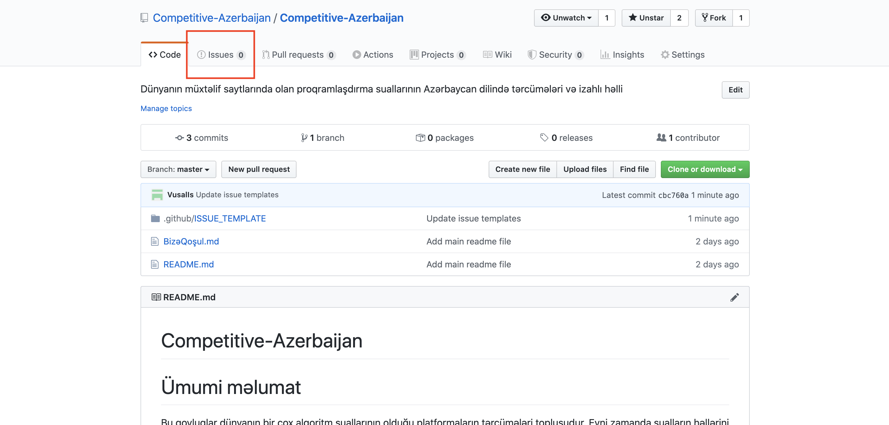
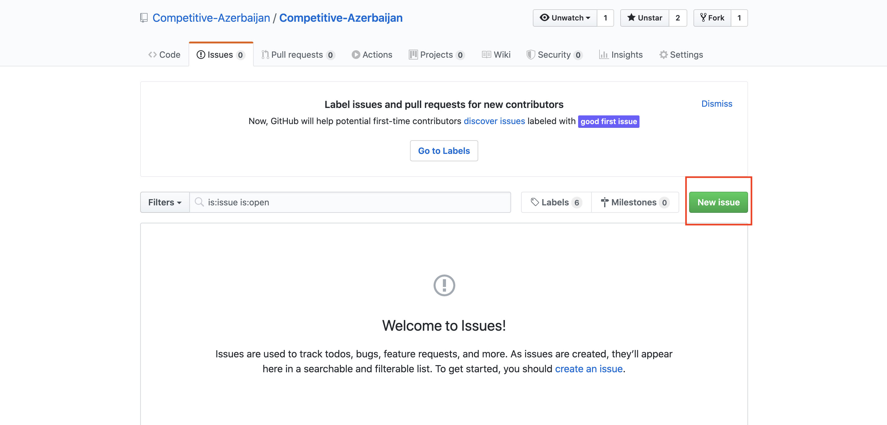
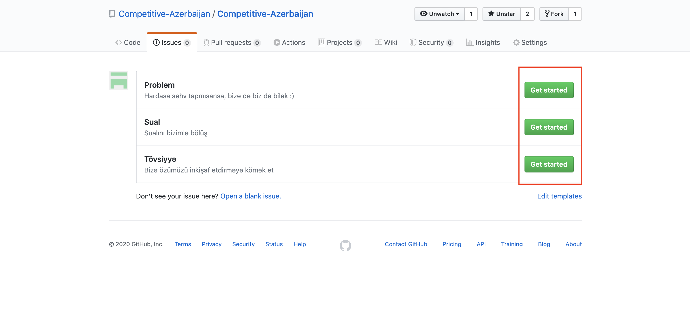
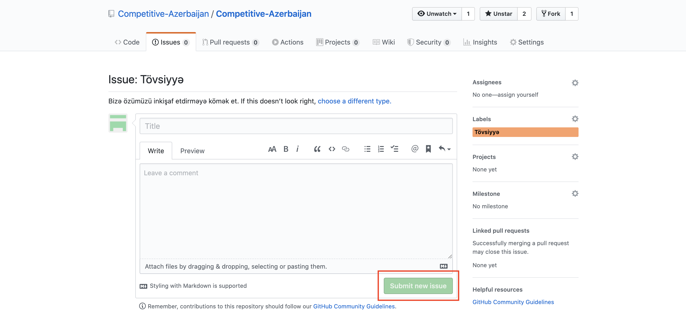

# Bizə Qoşul

Bu proyektə 3 yolla kömək edə bilərsiniz:

-   [Suallar ver :)](#suallar-ver)

# Suallar ver

Bu proyektin yaranma səbəbi alqoritmləri daha yaxşı öyrənmək və bildiklərimizi başqalarına ötürməkdir. Əgər hər hansı bir sualın yaranarsa burda göstərilən təlimatı izlə və səhv etməkdən qorxma, biz buna görə burdayıq :)

1. "Issues" bölməsinə keç

2. "New issues" düyməsini bas

3. Sual bölməsinin yanındakı "Get started" düyməsinə bas

4. Başlığı və sualını yazdıqdan sonra "Submit new issue" düyməsini bas və sualına cavabı tap :)

