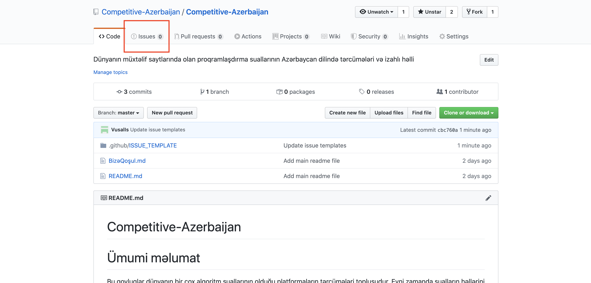
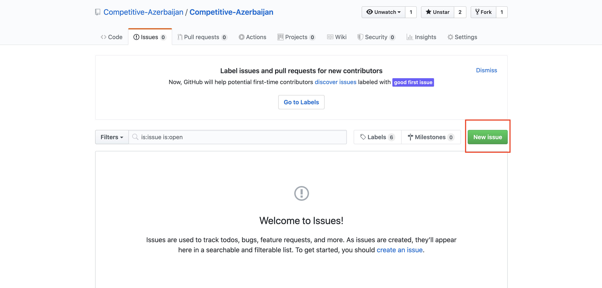
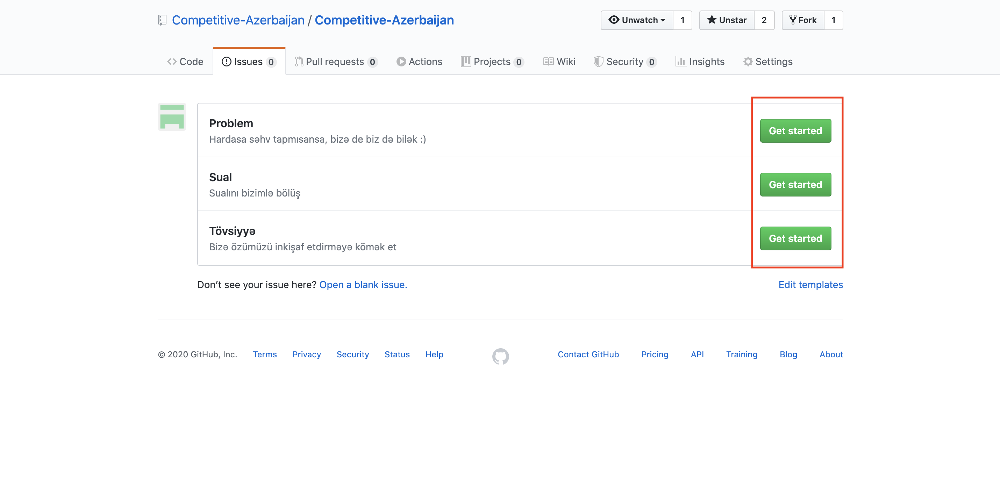
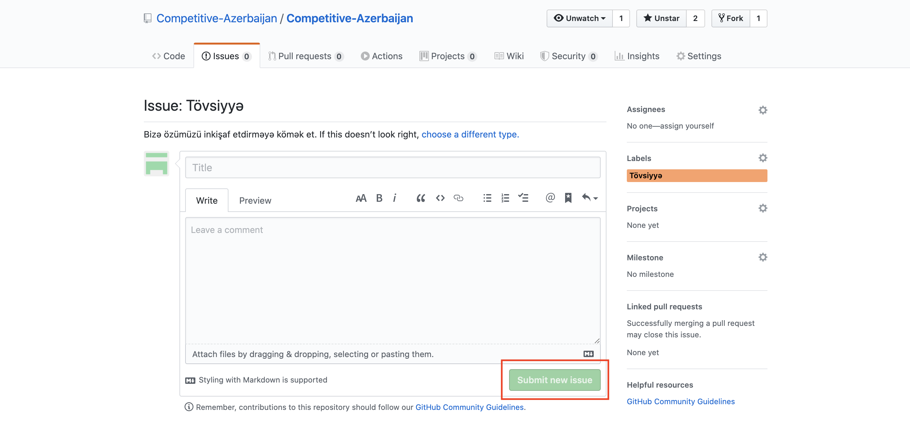

# Bizə Qoşul

Bu proyektə 2 yolla kömək edə bilərsiniz:

-   [Suallar ver, Tövsiyyələrini bizimlə bölüş, Daha yaxşı olmaq üçün problemləri bizə də de :)](#təlimat)
-   [Səhvləri düzəlt](#Səhvləri-düzəlt)
-   [Suallara kömək et](#Suallara-kömək-et)

# Təlimat

Burada göstərilən təlimatları izləyərək bizimlə hər şeyi bölüşə bilərsən.

1. "Issues" bölməsinə keç

2. "New issues" düyməsini bas

3. Özünə uyğun bölmənin yanındakı "Get started" düyməsinə bas

4. Başlığı və sualını yazdıqdan sonra "Submit new issue" düyməsini bas və sualına cavabı tap :)

 

# Suallara kömək et

Əgər siz də, suallar yazaraq dəstək olmaq istəyirsinizsə, təlimat tezliklə yüklənəcək. Hələlik isə aşağıdakı xarici mənbələrdən təlimatları sizə təqdim edirik. Zəhmət olmasa sualları yazarkən [Nümunə.md](static/Nümunə.md) faylından istifadə edin.

Türk dilində:
https://www.youtube.com/watch?v=OZ7vVWM7g74

İngilis dilində:
https://www.youtube.com/watch?v=4vPNMw0R8HE
